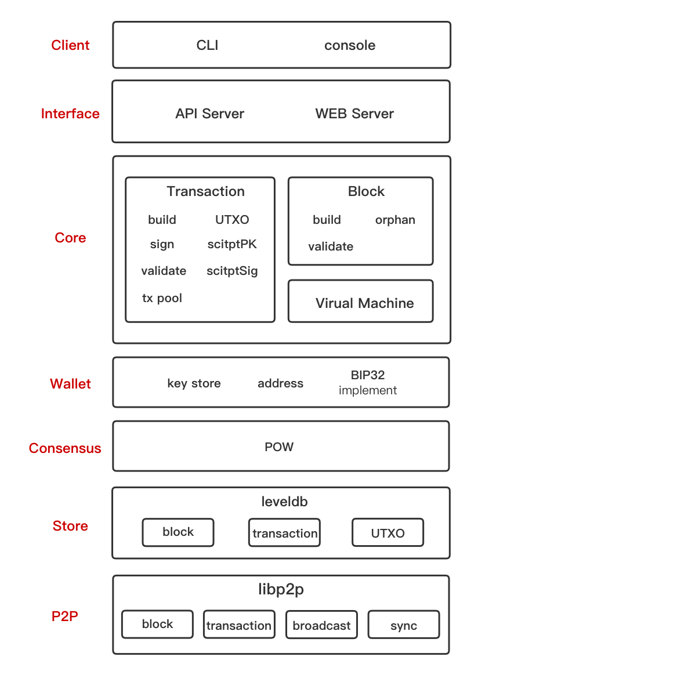

## Reed
Reed 是一个用于学习交流的开源区块链项目。区块链项目虽说不上要用什么新技术开发，但是里面涉及到的知识不少，例如 P2P、密码学、共识算法、UTXO 模型虚拟机等等。如果能参与开发这样一个项目，相信就能熟练地掌握这些技术。

也可以说 Reed 是一个“去中心化账本”项目，功能几乎和比特币一样。实际上，在开发过程中很多地方都会参考比特币。但是对于这样一个小项目来说，比特币还是过于臃肿，所以会砍掉一些没必要的功能，比如验签的隔离见证（Segregated Witness）。隔离见证虽然对区块进行了优化，但对于目前的 Reed 来说，先跑起来更重要（至少第一个版本是这样），所以选择将 ScriptSig/ScriptPk 直接放在区块；还有多签机制也砍掉，只剩下一个 P2PKH 的支付方式。目标是使用最小限度的功能，搭建一个“去中心化本”。

Reed is an open-source blockchain project for learning and communication. Although we don't need any new technology to develop a blockchain project, there is still a lot of knowledge covered, like P2P, Cryptology, Consensus Algorithms, UTXO Model-based Virtual Machine, etc. Developing such a project can help us master these technologies.

Reed is a "decentrialized ledger" with almost the same functions as Bitcoin. Actually, most of its developing procedures will refer to Bitcoin. But for such a small project, Bitcoin is still too bloated to refer to. Hence, we cut off some unnecessary functions, like Segregated Witness. Although Segregated Witness optimizes the blocks, our priority is to run the Reed (at least the first version), so we put the ScriptSig/ScriptPk directly in the blocks. The Multi-signature Scheme is trimmed as well, and we only keep the P2PKH payment method. Since our goal is to use the minimal functions to construct a "decentralized ledger". 

## Framework

*Reed v1.0*

## Running
待续

## Configuration
待续

## Contribution
如果你也有兴趣一起参与到这个项目，一起交流学习，欢迎fork。贡献并不一定是参与编码，也可以是翻译文档、探讨相关技术，为项目提供其他支持。

## License
reed是一个遵守MIT协议的开源项目，如果想了解更多信息请浏览COPYING文件。

Reed is released under the terms of the MIT license. See COPYING for more information or see https://opensource.org/licenses/MIT.
